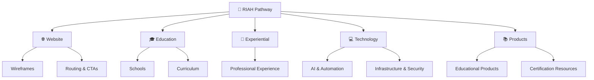
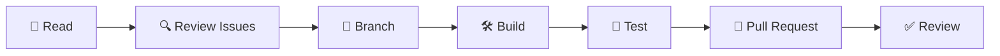

  

  <strong>Education • Experience • Certifications • Opportunity • Career • Legacy</strong>

RIAH Pathway is an education, workforce development, technology, and experiential learning ecosystem connecting education with real-world experience, professional preparation, technology, career development, and entrepreneurship.

---

## 👑 FOUNDER & LEADERSHIP

  

| Category | Details |
|---|---|
| 👤 **Contributor/Founder/CEO/Chairman** | **Mariah Dominique Rucker** |
| 👑 **Role** | Founder, CEO & Chairman |
| 🏗️ **Current Build Status** | Currently building RIAH Pathway independently |
| 👥 **Current Team** | No current team — beta team hiring begins October 2026 |
| 💻 **Beta Leadership Hiring** | CTO and CISO |
| 💼 **Experiential Hiring** | Experiential professionals |
| 🎓 **Faculty Hiring** | PhD-qualified faculty and adjunct faculty |
| 🌐 **Additional Hiring** | Additional roles across the ecosystem |
| 🚀 **Beta Cohort** | Spring 2027 |
| 🤝 **Beta Team** | Equity + compensation during beta |
| 🌐 **Website Launch** | October 2026 |

### 🔗 CONTRIBUTOR PROFILES

| Platform | Profile |
|---|---|
| 💻 **GitHub** | [Mariah Dominique Rucker](https://github.com/mariahdominiquerucker) |
| 💼 **LinkedIn** | [Mariah Dominique Rucker](https://linkedin.com/in/mariahrucker) |
| 📘 **Facebook** | [@heymariahrucker](https://facebook.com/heymariahrucker) |
| 📸 **Instagram** | [@heymariahrucker](https://instagram.com/heymariahrucker) |
| 🌳 **Linktree** | [Mariah Rucker](https://linktr.ee/mariahrucker) |
| ▶️ **YouTube** | [@mariahrucker](https://youtube.com/@mariahrucker) |

---

## 🏛️ About RIAH Pathway

RIAH Pathway connects education, experiential development, professional preparation, technology, certification preparation, career development, and entrepreneurship within one developing ecosystem.

This GitHub organization supports development of RIAH Pathway's website, technology, automation, curriculum structures, documentation, workflows, contributor resources, and supporting systems.

| Area | Focus |
|---|---|
| 🎓 **Education** | Academic and professional pathways |
| 💼 **Experience** | Progressive experiential development |
| 📚 **Certifications** | Professional and certification preparation |
| 💻 **Technology** | Websites, AI, automation, systems and integrations |
| 🔐 **Cybersecurity** | Security-focused technology development |
| 🧠 **Curriculum** | Curriculum structures and educational resources |
| 🛍️ **Products** | Educational and professional products |
| 🤝 **Contributors** | Collaborative development and open-source participation |
| 🚀 **Career** | Professional development and career pathways |
| 👑 **Entrepreneurship** | Business development and independent pathways |

---

## 🎓 Education Pathways

| Pathway | Purpose |
|---|---|
| 🎓 **High School** | Secondary education pathway |
| 📘 **GED** | High school equivalency pathway |
| 📚 **Certificates** | Focused educational credentials |
| 🎓 **Associate's** | Undergraduate education |
| 🎓 **Bachelor's** | Undergraduate education |
| 📖 **Minor** | Supplemental academic specialization |
| 🎓 **Master's / MBA** | Graduate education |
| ⚖️ **Law** | JD and applicable non-JD pathways |
| 💼 **Experiential** | Progressive professional experience |
| 📚 **Certification Review** | Professional certification preparation |
| 📖 **Continuing Education** | Ongoing professional development |

---

## 🏫 Schools

| School | Focus |
|---|---|
| 👑 **School of Business** | Business, accounting, finance and related disciplines |
| 💻 **School of Technology** | Technology, cybersecurity and software-focused disciplines |
| ⚖️ **School of Law** | Legal education and professional preparation |
| 🛡️ **School of Homeland Security** | Homeland security and related disciplines |
| 📚 **School of Foundations** | High School and GED pathways |
| 💼 **Experiential School** | Applied professional experience |

---

## 💼 Experiential Pathway

| Level | Duration |
|---|---:|
| 🌱 **Apprentice** | 1 Month |
| 💼 **Intern** | 3 Months |
| 📈 **Associate** | 1 Year |
| ⭐ **Senior Associate** | 1 Year |
| 👥 **Manager** | 1 Year |
| 👑 **Executive** | 1 Year |

---

## 💻 Technology & Development

| Technology Area | Development Focus |
|---|---|
| 🌐 **Web** | Websites and digital experiences |
| 🤖 **AI** | AI systems and agents |
| ⚙️ **Automation** | Automated workflows and operations |
| 🔗 **APIs** | Integrations and connected systems |
| 🔐 **Cybersecurity** | Security and access controls |
| ☁️ **Infrastructure** | Servers, cloud and platform infrastructure |
| 📊 **Data** | Databases, analytics and reporting |
| 🎓 **EdTech** | Education technology |
| 🛠️ **Internal Systems** | Operational applications and tools |

---

## 📂 GitHub Repositories

| Repository | Purpose |
|---|---|
| 🌐 **[Website-Draft](https://github.com/RIAHPathway/Website-Draft)** | Website development, wireframes, curriculum structures, pricing resources, contributor documentation and ecosystem planning |
| 👑 **[.github](https://github.com/RIAHPathway/.github)** | GitHub organization profile and organization-level configuration |

### 🔗 Development Resources

| Resource | View |
|---|---|
| 🖥️ **Website Wireframes** | [Open Folder](https://github.com/RIAHPathway/Website-Draft/tree/main/RIAH-PATHWAY-WEBSITE-WIREFRAMES-STRUCTURE) |
| 🗺️ **Navigation & Sitemap** | [View Structure](https://github.com/RIAHPathway/Website-Draft/blob/main/RIAH-PATHWAY-WEBSITE-WIREFRAMES-STRUCTURE/RIAH-PATHWAY-WEBSITE-NAVIGATION-SITEMAP.md) |
| 🔗 **Routing, Links & CTAs** | [View Routing](https://github.com/RIAHPathway/Website-Draft/blob/main/RIAH-PATHWAY-WEBSITE-WIREFRAMES-STRUCTURE/RIAH-PATHWAY-COMBINED-ROUTING-LINKS-CTA-BUTTONS.md) |
| 📚 **Curriculum Structure** | [Open Curriculum](https://github.com/RIAHPathway/Website-Draft/tree/main/RIAH-PATHWAY-CURRICULUM-STRUCTURE) |
| 💰 **Tuition & Pricing** | [Open Tuition](https://github.com/RIAHPathway/Website-Draft/tree/main/RIAH-PATHWAY-TUITION-PRICING-FEES) |
| 🤝 **Contributor Benefits** | [Open Contributor Structure](https://github.com/RIAHPathway/Website-Draft/tree/main/RIAH-PATHWAY-CONTRIBUTOR-BENEFITS-STRUCTURE) |

---

## 🧩 Development Structure

---

## 📚 Curriculum Development

Public GitHub resources may support eligible development of:

**Curriculum Structures • Documentation • Course Resources • Technical Exercises • Labs • Certification Resources • Study Materials • Policies • Templates • Educational Media**

| Curriculum Area | Repository |
|---|---|
| 📘 **GED** | [View Structure](https://github.com/RIAHPathway/Website-Draft/tree/main/RIAH-PATHWAY-CURRICULUM-STRUCTURE/RIAH-PATHWAY-GED-STRUCTURE) |
| 📚 **General Curriculum** | [View Structure](https://github.com/RIAHPathway/Website-Draft/tree/main/RIAH-PATHWAY-CURRICULUM-STRUCTURE/RIAH-PATHWAY-GENERAL-STRUCTURE) |
| 🎓 **High School** | [View Structure](https://github.com/RIAHPathway/Website-Draft/tree/main/RIAH-PATHWAY-CURRICULUM-STRUCTURE/RIAH-PATHWAY-HIGH-SCHOOL-STRUCTURE) |
| 💼 **Business** | [View Structure](https://github.com/RIAHPathway/Website-Draft/tree/main/RIAH-PATHWAY-CURRICULUM-STRUCTURE/RIAH-PATHWAY-SCHOOL-OF-BUSINESS-STRUCTURE) |
| 💻 **Technology** | [View Structure](https://github.com/RIAHPathway/Website-Draft/tree/main/RIAH-PATHWAY-CURRICULUM-STRUCTURE/RIAH-PATHWAY-SCHOOL-OF-TECHNOLOGY-STRUCTURE) |
| ⚖️ **Law** | [View Structure](https://github.com/RIAHPathway/Website-Draft/tree/main/RIAH-PATHWAY-CURRICULUM-STRUCTURE/RIAH-PATHWAY-SCHOOL-OF-LAW-STRUCTURE) |
| 🛡️ **Homeland Security** | [View Structure](https://github.com/RIAHPathway/Website-Draft/tree/main/RIAH-PATHWAY-CURRICULUM-STRUCTURE/RIAH-PATHWAY-SCHOOL-OF-HOMELAND-SECURITY) |

> 🔐 Public GitHub development does not mean all RIAH Pathway curriculum, internal systems, infrastructure, business information, or intellectual property is public or open source.

---

## 🛍️ Products & Professional Resources

| Category | Examples |
|---|---|
| 📚 **Textbooks** | Educational and professional learning |
| 📝 **Workbooks** | Applied learning activities |
| 📖 **Study Guides** | Academic and certification preparation |
| 🗂️ **Flashcards** | Study and review resources |
| 📓 **Journals & Planners** | Academic and professional organization |
| 📚 **Certification Review** | Professional certification preparation |
| ⚖️ **Bar Review** | Legal examination preparation |
| 💻 **Digital Products** | Select digital resources |
| 📦 **Print Products** | Primary physical product format |

---

## 🤝 Contributors

RIAH Pathway GitHub projects may include opportunities for eligible:

**Developers • Educators • Students • Designers • Researchers • Cybersecurity Professionals • Business Professionals • Curriculum Contributors • Content Creators • Community Contributors**

| Contribution Area | Examples |
|---|---|
| 💻 **Development** | Features, code and technical improvements |
| 🌐 **Website** | UI, UX and accessibility |
| 🔐 **Security** | Security improvements |
| 🤖 **Automation** | Workflows and integrations |
| 📚 **Education** | Curriculum and documentation |
| 🎨 **Creative** | Graphics and digital assets |
| 🔬 **Research** | Research and testing |
| 🌎 **Community** | Resources and ecosystem improvements |

---

## 🔄 Contribution Workflow

Repository-specific contribution requirements, licenses, intellectual property requirements, and community standards apply.

---

## 🚀 Current Development

| Milestone | Status |
|---|---|
| 🌐 **Website Development** | 🔄 In Development |
| 🧭 **Website Wireframes** | 🔄 In Development |
| 📚 **Curriculum Structures** | 🔄 In Development |
| 💻 **Technology Infrastructure** | 🔄 In Development |
| 🤖 **AI & Automation** | 🔄 In Development |
| 🤝 **Beta Team Development** | 🔄 In Progress |
| 🎓 **Beta Cohort** | 📅 Spring 2027 |

---

## 👑 Founder & Contributor

| Category | Details |
|---|---|
| 👤 **Contributor/Founder/CEO/Chairman** | **Mariah Dominique Rucker** |
| 👑 **Role** | Founder, CEO & Chairman |
| 🏗️ **Development** | RIAH Pathway |
| 💻 **GitHub** | [Mariah Dominique Rucker](https://github.com/mariahdominiquerucker) |
| 💼 **LinkedIn** | [Mariah Dominique Rucker](https://linkedin.com/in/mariahrucker) |
| 📸 **Instagram** | [@heymariahrucker](https://instagram.com/heymariahrucker) |
| ▶️ **YouTube** | [@mariahrucker](https://youtube.com/@mariahrucker) |
| 🌳 **Linktree** | [Mariah Rucker](https://linktr.ee/mariahrucker) |

---

## 📜 Intellectual Property

RIAH Pathway includes public development alongside proprietary and restricted components.

Public repository access does not automatically waive applicable:

**Copyright • Trademark • Proprietary Rights • Licensing Requirements • Confidentiality • Intellectual Property Protections**

Contributors and users should review the applicable repository documentation and license before using, modifying, or redistributing materials.

---

## 📬 Connect With RIAH Pathway

---

### 👑 RIAH PATHWAY

**Education • Experience • Certifications • Opportunity • Career • Legacy**

