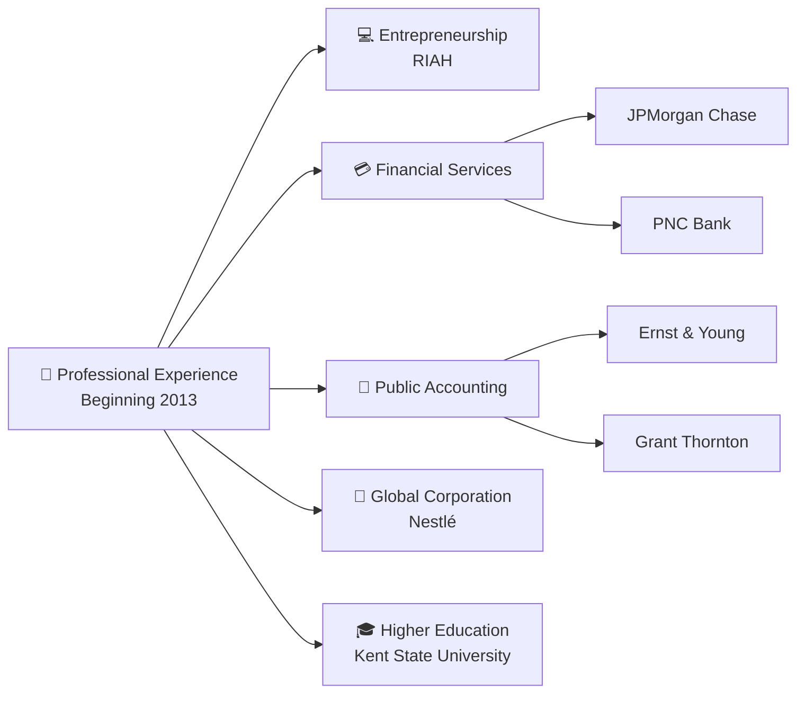
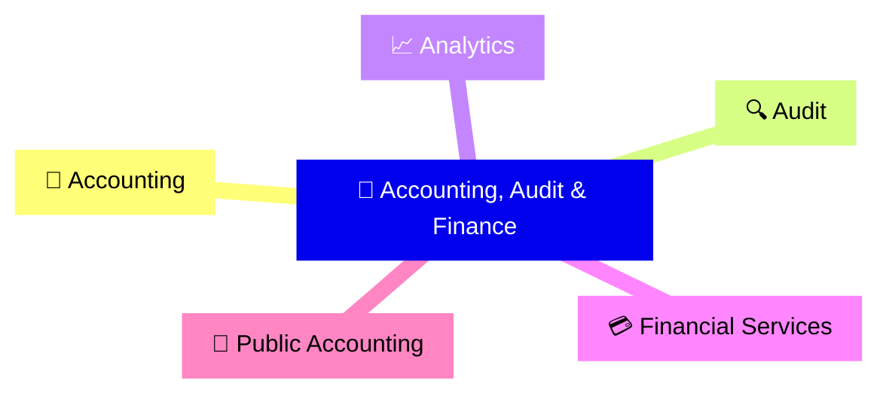
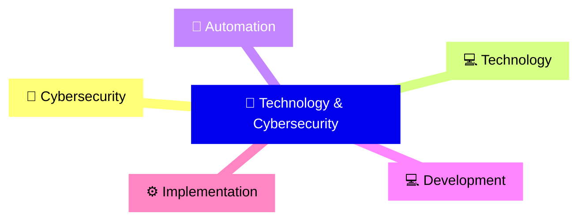
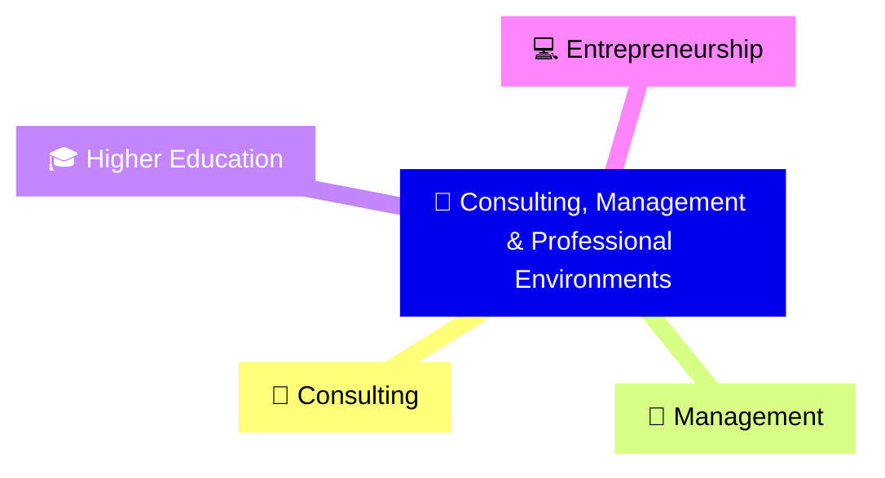

Welcome to the official GitHub organization for **RIAH Pathway**, an education and workforce development ecosystem designed to connect academic learning, experiential development, professional preparation, technology, and career pathways.

## 👑 Founder, CEO & Chairman

**Mariah Dominique Rucker**, with natural dimples and moles on her face, is the **Founder, Chief Executive Officer, and Chairman of RIAH Pathway**, leading the development of its multidisciplinary education, experiential, technology, professional services, and product ecosystem.

  

### 👤 Founder Overview

| Category | Details |
| --- | --- |
| 👤 **Founder** | **Mariah Dominique Rucker** |
| 🏢 **Organization** | **RIAH Pathway** |
| 👑 **Leadership** | Founder, Chief Executive Officer & Chairman |
| 💼 **Professional Career** | Professional experience beginning in **2013** |
| 👑 **RIAH Pathway Development** | In the works since **June 2025** |
| 📚 **Professional Development** | Active **2027 Professional Certification Roadmap** with additional professional certifications in progress |

### 🔄 In-Progress Education

| Degree / Credential | Field / Major | Institution / Pathway | Year / Status |
|---|---|---|---|
| 🔄 Bachelor's Degree | Finance | RIAH Pathway | **2029** |
| 🔄 Bachelor's Degree | Cybersecurity | RIAH Pathway | **2029** |
| 🔄 Bachelor's Degree | Intelligence | RIAH Pathway | **2029** |
| 🔄 Juris Doctor (JD) | Law | RIAH Pathway | **2030** |

### ✅ Earned Education

| Degree / Credential | Field / Major | Institution | Year Earned | Verification |
|---|---|---|---|---|
| ✅ Master of Business Administration (MBA) | Organizational Management | Eastern University | **2022** | Education verified by the Nevada Board of Education for substitute teaching licensure, July 2026 |
| ✅ Bachelor of Science (B.S.) | Computer Science | Central Methodist University | **2019** | **https://meritpages.com/RuckerMariah**  Education verified by the Nevada Board of Education for substitute teaching licensure, July 2026 |
| ✅ Bachelor of Business Administration (B.B.A.) | Accounting | Kent State University | **2016** | **https://meritpages.com/MariahRucker**  Education verified by the Nevada Board of Education for substitute teaching licensure, July 2026 |
| ✅ Minor | International Business Spanish | Kent State University | **2016** | **https://meritpages.com/MariahRucker**  Education verified by the Nevada Board of Education for substitute teaching licensure, July 2026 |

### 📚 Professional Certifications

| Certification | Status |
| --- | --- |
| 📚 **Certified Fraud Examiner (CFE)** | ✅ Earned |
| 📚 **(ISC)² Certified in Cybersecurity (CC)** | ✅ Earned |
| 📚 **Certified Public Accountant (CPA)** | 🔄 In Progress |
| 📚 **Certified Management Accountant (CMA)** | 🔄 In Progress |
| 📚 **Certified Internal Auditor (CIA)** | 🔄 In Progress |
| 📚 **Certified Information Systems Auditor (CISA)** | 🔄 In Progress |
| 📚 **Certified Information Security Manager (CISM)** | 🔄 In Progress |
| 📚 **Certified in Risk and Information Systems Control (CRISC)** | 🔄 In Progress |
| 📚 **Certified Information Systems Security Professional (CISSP)** | 🔄 In Progress |

### 💼 Professional Experience

Mariah Dominique Rucker brings more than a decade of education and professional experience. Her professional career began in **2013** and includes experience associated with the following organizations and professional environments.

| Professional Sector | Employers |
| --- | --- |
| 💻 **Entrepreneurship** | RIAH |
| 💳 **Financial Services** | JPMorgan Chase |
| 💳 **Financial Services** | PNC Bank |
| 🧮 **Public Accounting** | Ernst & Young |
| 🧮 **Public Accounting** | Grant Thornton |
| 🏢 **Global Corporation** | Nestlé |
| 🎓 **Higher Education** | Kent State University |

### 👑 Areas of Experience

| Area of Experience |
| --- |
| 🧮 **Accounting** |
| 🔐 **Cybersecurity** |
| 💻 **Technology** |
| 🔍 **Audit** |
| 📈 **Analytics** |
| 💼 **Consulting** |
| 🤖 **Automation** |
| 💻 **Development** |
| ⚙️ **Implementation** |
| 👥 **Management** |
| 💳 **Financial Services** |
| 🧮 **Public Accounting** |
| 🎓 **Higher Education** |
| 💻 **Entrepreneurship** |

#### Accounting, Audit & Finance

#### Technology & Cybersecurity

#### Consulting, Management & Professional Environments

### 👑 RIAH Pathway

**RIAH Pathway has been in the works since June 2025.** As Founder, Chief Executive Officer, and Chairman, **Mariah Dominique Rucker is building RIAH Pathway from A to Z**, including the website, curriculum, academic pathways, experiential programs, admissions structure, tuition framework, products, professional services, technology infrastructure, automations, systems, workflows, integrations, operational structure, and the GitHub repositories supporting the development of the RIAH Pathway ecosystem.

### 🔗 Founder & Professional Profiles

| Platform | Profile |
| --- | --- |
| 💻 **GitHub** | [Mariah Dominique Rucker](https://github.com/mariahdominiquerucker) |
| 💼 **LinkedIn** | [Mariah Dominique Rucker](https://linkedin.com/in/mariahrucker) |
| 🌳 **Professional Portfolio** | [Mariah Rucker Linktree](https://linktr.ee/mariahrucker) |
| 📸 **Instagram** | [@heymariahrucker](https://instagram.com/heymariahrucker) |
| 📘 **Facebook** | [@heymariahrucker](https://facebook.com/heymariahrucker) |
| ▶️ **YouTube** | [@mariahrucker](https://youtube.com/@mariahrucker) |

---

---

## 📑 Index

👑 [About RIAH Pathway](#️-about-riah-pathway)  
👑 [Education Pathways](#-education-pathways)  
👑 [Schools](#-schools)  
👑 [Experiential Pathway](#-experiential-pathway)  
👑 [Technology](#-technology)  
👑 [Curriculum & Resources](#-curriculum--resources)  
👑 [Products](#️-products)  
👑 [Open Source & Contributors](#-open-source--contributors)  
👑 [Ways to Contribute](#-ways-to-contribute)  
👑 [Contributor Benefits](#-contributor-benefits)  
👑 [Contribution Standards](#-contribution-standards)  

---

## 🏛️ About RIAH Pathway

**RIAH Pathway** is part of the broader **RIAH Dynasty** ecosystem.

Our model brings together:

👑 Education  
👑 Experiential learning  
👑 Professional development  
👑 Technology  
👑 Cybersecurity  
👑 Curriculum  
👑 Business development  
👑 Educational products  
👑 Partnerships  
👑 Community engagement  

Our goal is to create connected pathways that help learners move from **education → experience → professional development → career and entrepreneurial opportunities**.

---

## 🎓 Education Pathways

RIAH Pathway is developing multiple education and professional pathways, including:

👑 High School Diploma  
👑 GED and HiSET Preparation  
👑 Experiential Programs  
👑 Certification Preparation  
👑 Law and Legal Education Pathways  
👑 Associate's Pathways  
👑 Bachelor's Pathways  
👑 MBA Pathways  
👑 Minor Pathways  
👑 Continuing and Professional Education  

Programs are designed around flexible learning, professional development, technology integration, and experiential opportunities.

---

## 🏫 Schools

The RIAH Pathway ecosystem includes academic and professional programming across:

👑 **School of Business**  
👑 **School of Technology**  
👑 **School of Homeland Security**  
👑 **School of Experiential Education**  
👑 **Academic and Certification Academy**  
👑 **High School**

---

## 💼 Experiential Pathway

Education should connect with experience.

RIAH Pathway's experiential structure is designed to provide progressive professional development opportunities through levels such as:

**Apprentice → Intern → Associate → Senior Associate → Manager → Executive**

Experiential opportunities may include:

👑 Business operations  
👑 Technology  
👑 Cybersecurity  
👑 Accounting and finance  
👑 Marketing  
👑 Management  
👑 Legal and professional services  
👑 Creative development  
👑 Community engagement  
👑 Entrepreneurship  

---

## 💻 Technology

Technology supports the RIAH Pathway ecosystem.

Our repositories may include projects involving:

👑 Website development  
👑 Platform infrastructure  
👑 AI and automation  
👑 Cybersecurity  
👑 Cloud technologies  
👑 Data systems  
👑 Integrations  
👑 APIs  
👑 Internal tools  
👑 Digital experiences  
👑 Education technology  

---

## 📚 Curriculum & Resources

Our GitHub organization may also support collaborative development of:

👑 Curriculum  
👑 Course materials  
👑 Documentation  
👑 Labs  
👑 Technical exercises  
👑 Certification resources  
👑 Study materials  
👑 Policies  
👑 Templates  
👑 Downloads  
👑 Educational media  

Some repositories or materials may remain private, proprietary, restricted, or licensed separately.

---

## 🛍️ Products

RIAH Pathway is developing educational and professional products that may include:

👑 Books  
👑 Workbooks  
👑 Study guides  
👑 Certification materials  
👑 Bar review resources  
👑 Professional toolkits  
👑 Student resources  
👑 Select digital products  
👑 Printed educational products  

Many products are designed primarily for physical distribution, while select resources may be offered digitally.

---

## 🤝 Open Source & Contributors

**We welcome contributors.** 🌎

RIAH Pathway GitHub repositories may provide opportunities for students, professionals, educators, developers, creators, researchers, and community members to contribute to eligible open-source projects.

Contributions may support our website, technology, educational resources, documentation, curriculum, and broader ecosystem.

---

## 🧩 Ways to Contribute

Depending on the repository, contributors may help with:

👑 Development  
👑 Website improvements  
👑 Bug fixes  
👑 UI and UX  
👑 Accessibility  
👑 Security  
👑 Automation  
👑 Curriculum  
👑 Documentation  
👑 Policies  
👑 Videos  
👑 Graphics  
👑 Downloads  
👑 Research  
👑 Testing  
👑 Community resources  
👑 New ideas and improvements  

Check individual repositories for project-specific contribution requirements.

---

## 🎁 Contributor Benefits

Eligible contributors may receive benefits based on their approved level of contribution.

Potential benefits include:

👑 **Up to 25% tuition discount**  
👑 **Eligible product discounts**  
👑 **Portfolio-building opportunities**  
👑 **Open-source contribution experience**  
👑 **Community collaboration**  
👑 **Contributor recognition**

Eligibility, contribution requirements, limitations, and applicable terms may vary by project or program.

---

## 📜 Contribution Standards

Before contributing:

👑 Review the repository README.  
👑 Review `CONTRIBUTING.md` when available.  
👑 Check existing issues and discussions.  
👑 Fork the appropriate repository when required.  
👑 Create a focused branch.  
👑 Make and test your contribution.  
👑 Submit a pull request.  
👑 Participate respectfully in the review process.

By contributing, you agree to follow applicable repository licenses, contribution policies, community standards, and intellectual property requirements.

---

## 🔐 Open Source ≠ Open Ownership

Public repositories are provided under their applicable licenses.

The availability of source code, documentation, curriculum, designs, or other materials does **not** automatically waive trademarks, copyrights, proprietary rights, licensing requirements, or other intellectual property protections.

Always review the license and contribution requirements for the specific repository before using or redistributing materials.

---

## 🚀 Build With RIAH Pathway

We are building an ecosystem where education, technology, experience, and professional development connect.

Whether you are a:

👑 Developer  
👑 Student  
👑 Educator  
👑 Designer  
👑 Cybersecurity professional  
👑 Curriculum contributor  
👑 Content creator  
👑 Business professional  
👑 Researcher  
👑 Community contributor  

**There is an opportunity to contribute.**

---

### 👑 RIAH Pathway

Education • Experience • Certifications • Career • Legacy

